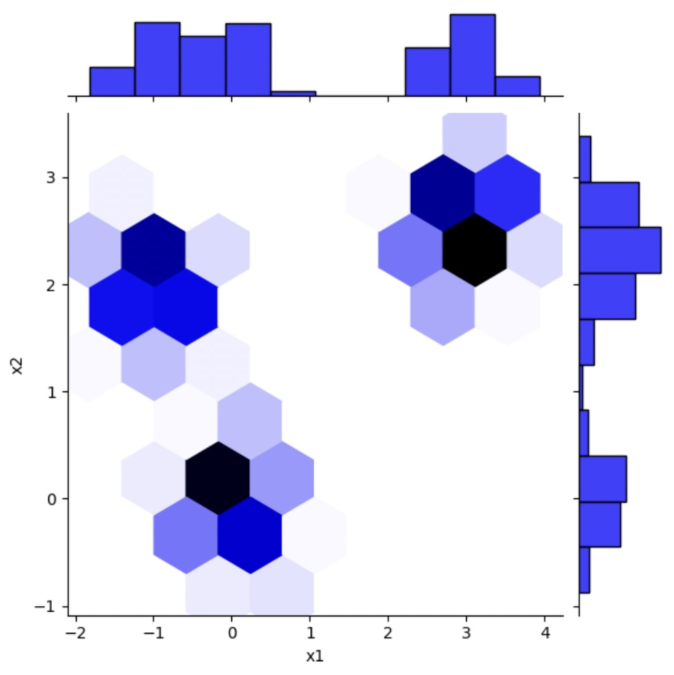
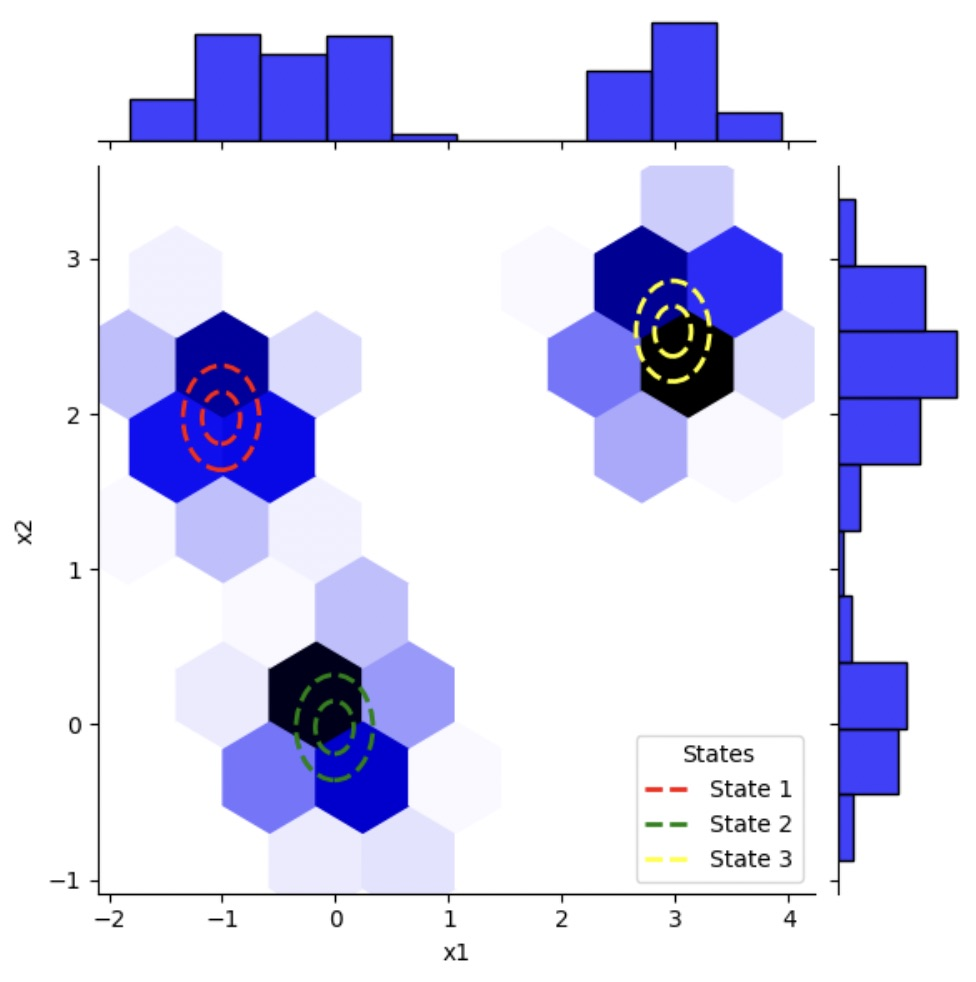
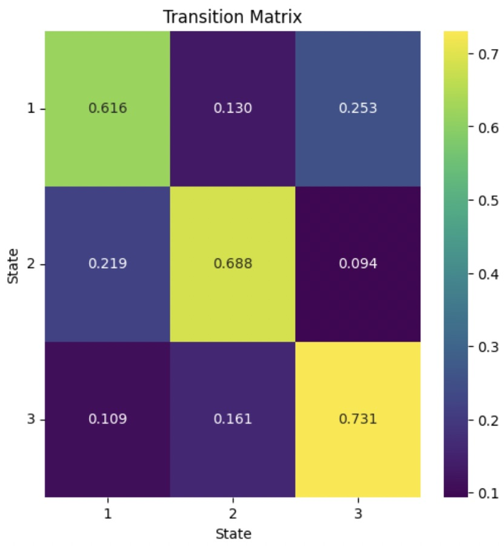

## Application Demo

Hello! Welcome to my Gaussian HMM demo. Check out how this cool probabilistic state space model works, feel free to check out the hmm.ipynb
file to see how the GaussianHMM class is coded, or the hmmglm.ipynb file to see how we can incorporate a generalised linear model into the HMM!

```python
import pandas as pd
import nbimporter
from hmm import GaussianHMM
```

Given a time-dependent sequence of observed data with an underlying k latent Gaussian state structure:

```python
data = pd.read_csv('observations_gaussian.csv')
data = data.to_numpy()
```



Notice in this simple example, k = 3, (more complex examples require cross-validation)

# We then fit our model:
```python
k = 3
# tolerance of fit, stops running model when steps of the log-likelihood are smaller than 1e-6
a_tol = 1e-6
# maximum number of iterations, stops running model when the 1000 iterations is met
max_iter = 1000

hmm = GaussianHMM(k)
hmm.fit(data, max_iter, a_tol)
```

Overlaying the trained model reveals a good fit of the emission distribution parameters:



We can also plot the transition matrix of the model fit to reveal the time-dependent transitions between states



With this information learned by our Gaussian Hidden Markov model, we can answer some really cool questions!
- What times are these states occurring?
- What causes the switches between states?
- How many observations on average do we generate by one state before a transition?

# Thank you for considering my application!
